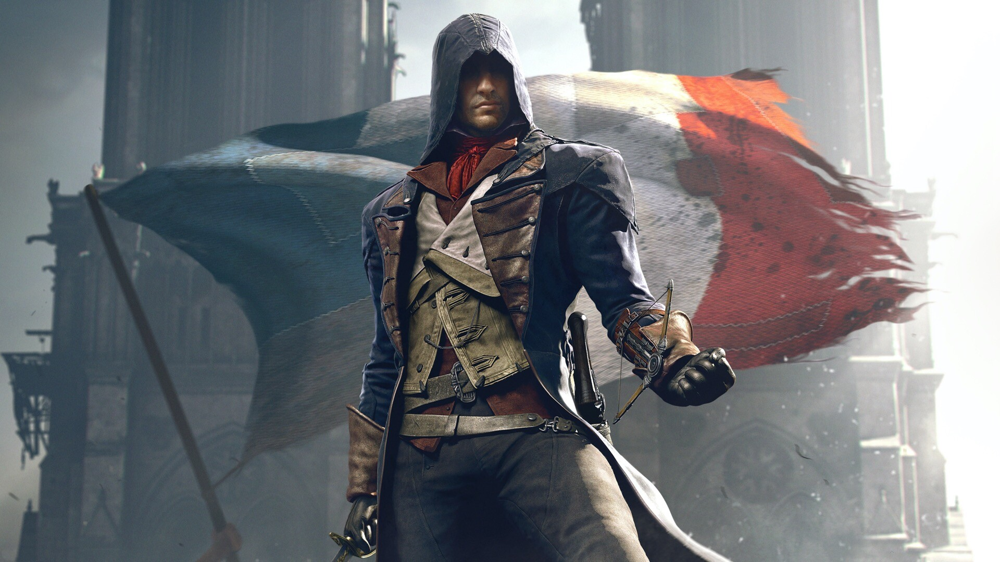
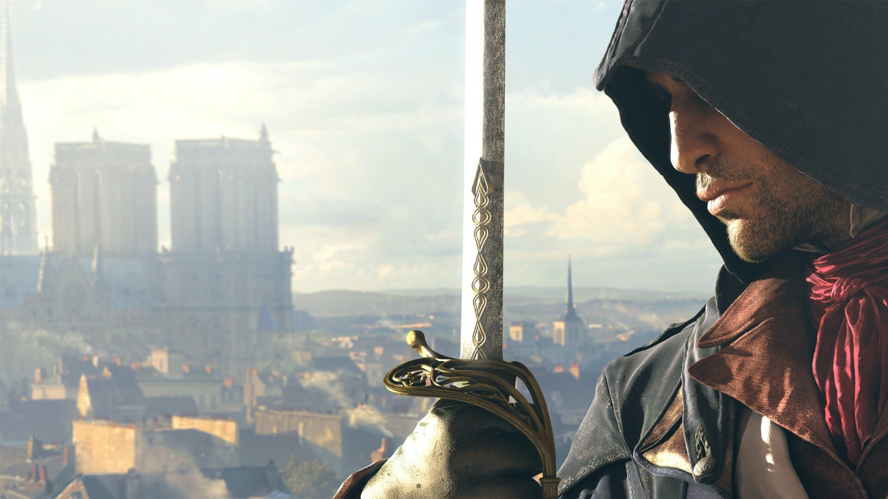
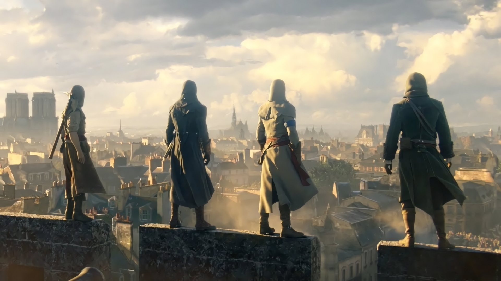
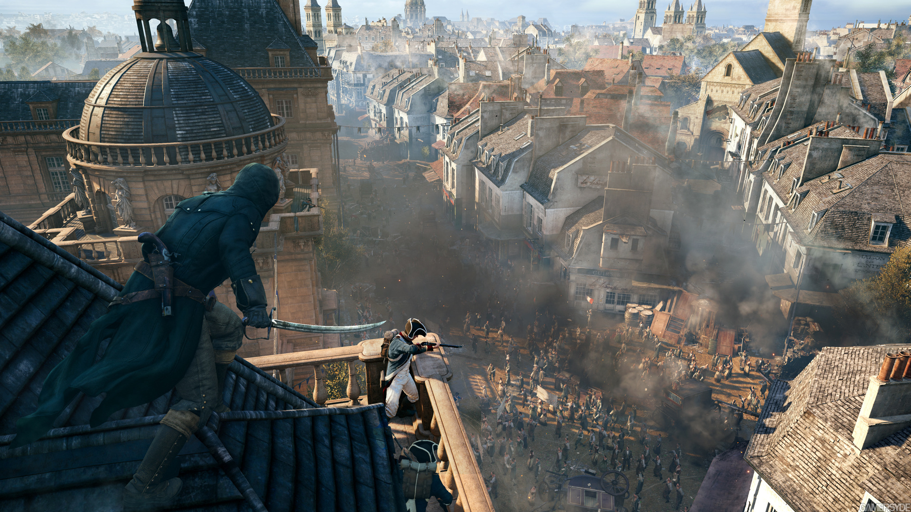

# 游戏《刺客信条：大革命》

----------
《刺客信条：大革命》是开放世界匿踪动作游戏《刺客信条》系列的最新作，这次的故事舞台将玩家带回了18世纪末「法国大革命」时期往后的巴黎历史中，玩家将跟随主角「亚诺．多瑞安」的脚步，再次卷入刺客与圣殿骑士数千年的争端内，同时亲身经历、感受从法国大革命时期起在巴黎所发生的种种故事。

游戏性方面《大革命》在次世代主机运算性能的加持下，场景细致程度与行人数量都有历代作品之最的表现，同时导入了在线多名玩家合作的多人游玩内容与搭配的角色客制成长系统，增添乐趣变化。

除此之外《大革命》最有趣的一点，是作品环境终于回到有如《刺客信条2》呈现文艺复兴时期意大利般，再度带来充满时代风情与文化氛围的城市舞台，我们将能操作伟大的刺客亚诺一一探访并征服花都巴黎在18世纪末的诸多著名建筑与景点！

《刺客信条：大革命》是《刺客信条》系列最新的一部作品，仅发售在PS4/XBOX ONE两台次世代主机与PC上，没有前世代主机版本。本篇文章分享使用画面将以XBOX ONE版为主。
 
 刺客信条》系列的历代作品内，让玩家扮演并留下深刻印象的是古老组织「刺客兄弟会」在每个时代最著名的刺客人物，有几部作品根据剧情需要我们甚至会体验到对立组织「圣殿骑士团」成员的人生。首部作品《刺客信条》在2007年发售，以传奇刺客阿泰尔．伊本．拉哈德（Altaïr ibn La-Ahad）在12世纪间第三次十字军东征时期发生的故事为轴心。
 
 
 从2007年到《大革命》的2014年，7年多的时间就让《刺客信条》发展成有8部核心作品、连旁枝共有将近20部作品的庞大阵容，是一个非常多产的系列。而这个系列让玩家印象最深的除了操作身体能力惊人的刺客，做出各种人类极限的动作、在高处攀爬跑动以达成刺杀目的这个核心操作感以外，每一部作品的故事与世界各地历史的深刻结合也是《刺客信条》最关键的魅力。

对于串连整个《刺客信条》系列的故事来说，有个非常重要的名词叫做「ANIMUS」，这是存在《刺客信条》游戏内一种虚拟的仪器，功能是透过分析DNA让人体验自己祖先发生过的故事。所以精确来说，前面三代《刺客信条》的主角并不是让玩家印象最深的那些刺客，而是一名活在现代的刺客后裔「戴斯蒙．迈尔斯（Desmond Miles）」。到了《刺客信条4：黑旗》与本作《刺客信条：大革命》时虽然已经不是戴斯蒙在体验记忆，不过概念是沿袭下来的，玩家扮演着一个为娱乐产品「HELIX」进行测试的测试者，HELIX背后正是ANIMUS的技术，与真实身份为圣殿骑士团的Abstergo公司。

《刺客信条：大革命》登入到次世代主机平台后，凭借平台优秀，造就了美丽的巴黎和优秀的合作模式。但是，尽管身披诸多优势，还是未能从根本上解决游戏的本质问题。反而又增加了很多新的麻烦。比如说镜头非常的笨拙。虽然多人合作与角色定制是成功的，但薄弱的故事让角色缺乏感染力。加上操作问题还没有解决，让玩家稍显失望。但是不得不为《刺客信条》系列加油鼓劲，毕竟《刺客信条:大革命》是作为第一部登入到次世代平台的作品，期待这部作品是未来育碧《刺客信条》卓越作品的创世纪。
